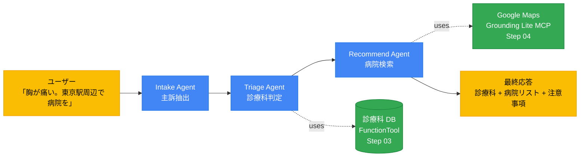
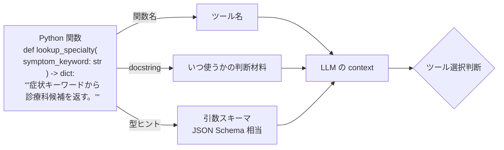
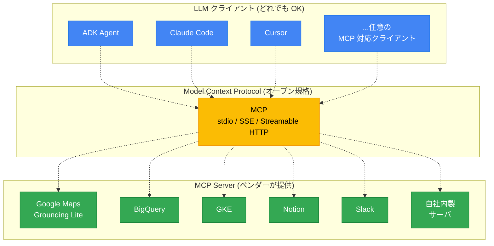
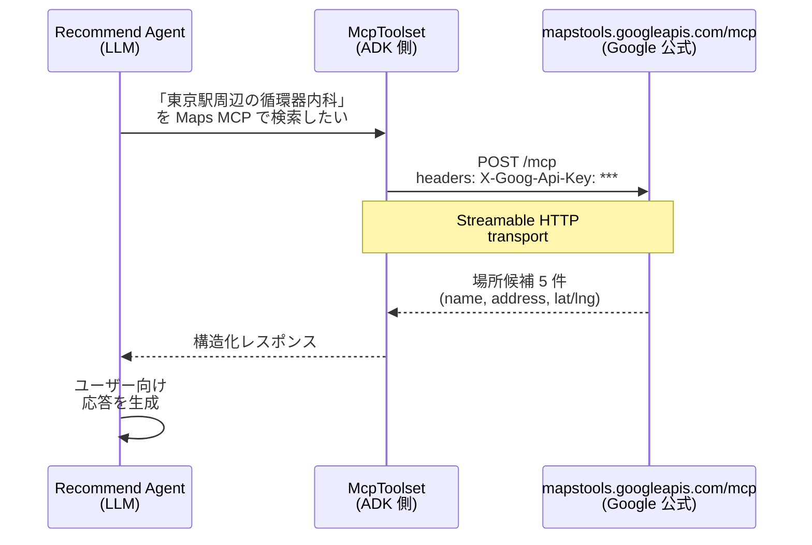
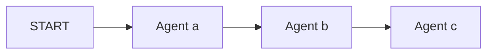
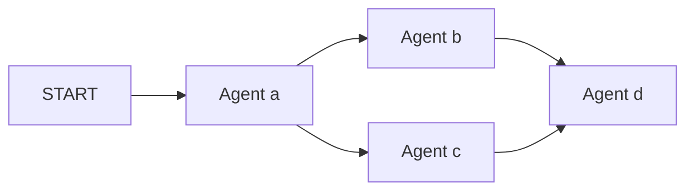
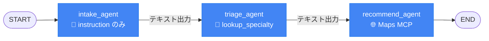
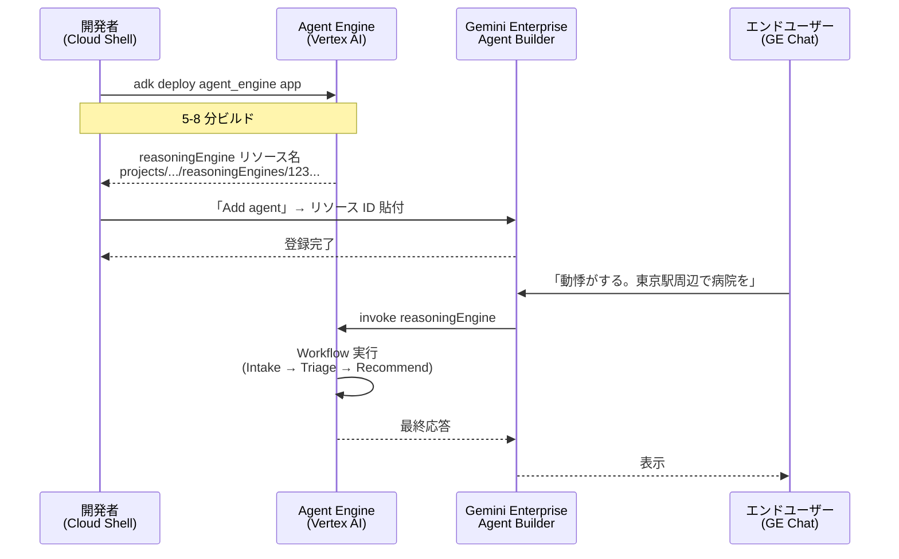
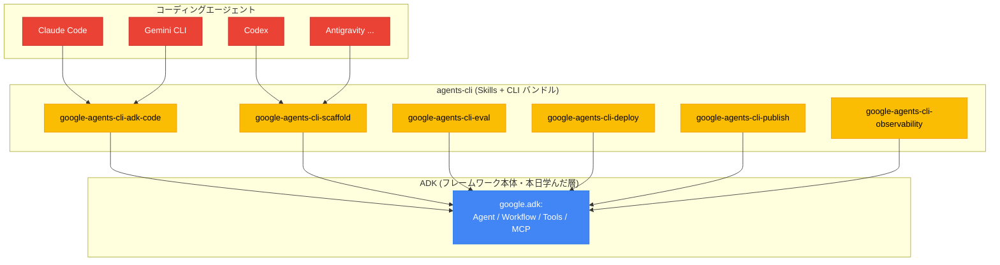

# スライド素材集

ワークショップ用スライドに貼る図・表をすべてここに集約。各素材は **そのまま Google Slides へ貼れる形式** (mermaid → mermaid.live で PNG 化、ASCII 表は monospace で貼り付け or 表に整形)。

> **使い方**
> 1. mermaid ブロックは [mermaid.live](https://mermaid.live) にコピペ → PNG export → Slides に貼付
> 2. ASCII 表 / 比較マトリクスは Slides のテーブルに変換、または monospace で
> 3. 各素材の冒頭にスライド番号 (例: `S#5`) と「話すポイント」を併記

---

## S#5 全体アーキ図 (北極星スライド)

**話すポイント**: 「今日 3 時間でこれを作る」と最初に見せて、各 Step がどの部品を足していくかを後で参照させる。



**色凡例 (スライドに併記)**:
- 🔵 青 = Agent (LLM 駆動)
- 🟢 緑 = Tool (関数 / MCP)
- 🟡 黄 = 入出力

---

## S#8 ADK 1.x → 2.0 Breaking Changes

**話すポイント**: 古い記事・1.x ベースの Codelab を信じて来た人への注意喚起。`Workflow` パラダイム転換が最大の変化。

| | ADK 1.x | ADK 2.0 (本日) |
|---|---|---|
| **多エージェント合成** | `SequentialAgent` / `LoopAgent` / `ParallelAgent` クラス | **`Workflow`** (graph-based engine) |
| **旧クラスの行方** | 標準 | `legacy_workflows/` 配下に移動 |
| **新パラダイム** | — | **Task API** (agent-to-agent 構造化委譲) |
| **import** | `from google.adk.agents import LlmAgent` | `from google.adk import Agent, Workflow` |
| **MCP 対応** | 限定的 | `McpToolset` で stdio / SSE / Streamable HTTP |
| **Tool 定義** | `FunctionTool(func)` ラップ | 関数を **直接** `tools=[func]` |
| **Eval** | 別ツール | `adk eval` 標準同梱 |
| **デプロイ** | `cloud_run` のみ | `cloud_run` / **`agent_engine`** / `gke` |
| **CLI** | `adk` | `adk` (サブコマンド充実) |

> 注: 1.x のクラスは互換性のため残されていますが、新規開発では Workflow を選ぶ。

---

## S#10 instruction vs description

**話すポイント**: 同じ Agent でも 2 つの「説明」がある。Step 05 Workflow で description が重要になる伏線。

```
┌─────────────────────────────────────────────────────────────┐
│  Agent(                                                     │
│    name="triage_agent",                                     │
│    model="gemini-3.5-flash",                                │
│    description="..."  ◄─ 他のエージェントに向けた自己紹介    │
│    instruction="..."  ◄─ このエージェント自身が従う行動指示  │
│    tools=[...],                                             │
│  )                                                          │
└─────────────────────────────────────────────────────────────┘
```

| | `instruction` | `description` |
|---|---|---|
| **向き** | 自分 → 自分 | 自分 → 他のエージェント |
| **使われる場面** | 毎回の LLM 呼び出し時 | Workflow / AgentTool の選択判断時 |
| **長さ** | 長め (役割 / フォーマット / ルール) | 1〜2 文サマリ |
| **書き間違い時の影響** | 出力品質が下がる | 「呼ばれない」「間違って呼ばれる」 |
| **本日の例** | 「症状を聞いたら以下のフォーマットで…」 | 「患者の症状文から推奨診療科を提示するエージェント」|

---

## S#17 docstring が agent 品質に直結する

**話すポイント**: ADK 2.0 では関数を直接 tools に渡せる。逆に言えば **docstring と型ヒントの品質が全て**。



> **キーメッセージ**: docstring が雑だと、LLM は「呼ぶべきときに呼ばない」「呼ぶべきでないときに呼ぶ」両方で失敗する。docstring は本番では agent quality に直結する。

---

## S#20 MCP の位置づけ

**話すポイント**: MCP は「ベンダー非依存の USB ポート」。LLM クライアントとツール / データソースを切り離す。



**補足スライド/口頭**:
- 2025: Anthropic がリファレンス実装を archive、ベンダー管理に移行
- 2025-12: Linux Foundation の Agentic AI Foundation (AAIF) が MCP ガバナンス取得
- 2026: Google 公式 50+ MCP サーバ (BigQuery / GKE / Workspace API / Maps Grounding Lite ...)

---

## S#23 Maps Grounding Lite の接続

**話すポイント**: ADK 2.0 では `McpToolset` を `tools=[...]` に渡すだけで関数ツールと同じインターフェース。



**接続コードの 1 ページ**:

```python
from google.adk.tools.mcp_tool import (
    McpToolset, StreamableHTTPConnectionParams
)

maps_mcp = McpToolset(
    connection_params=StreamableHTTPConnectionParams(
        url="https://mapstools.googleapis.com/mcp",
        headers={"X-Goog-Api-Key": os.environ["MAPS_API_KEY"]},
        timeout=30.0,
        sse_read_timeout=300.0,
    ),
)

Agent(..., tools=[maps_mcp])   # ← 関数ツールと同じインターフェース
```

---

## S#26 マルチエージェント 4 パラダイム比較 ★★ (本日の核心)

**話すポイント**: ADK 2.0 で複数 Agent を束ねる方法は 4 つ。「順序固定 / 抜け禁止」の業務フローには Workflow が最適、と納得させるのがゴール。

| パラダイム | 制御性 | 柔軟性 | 適する場面 | 本日の使い分け |
|---|---|---|---|---|
| **Workflow** (graph) | ★★★★ deterministic | ★★ 構造固定 | 順序が決まった業務フロー、抜けが許されない処理 | ✅ Step 05 で採用 |
| **AgentTool** | ★★ LLM 判断 | ★★★★ 動的 | 「使うかどうか」LLM に任せたい補助エージェント | (補足のみ) |
| **sub_agents** (transfer) | ★★ LLM 判断 | ★★★★ 動的 | 専門領域別に窓口を分けて受け流す | (補足のみ) |
| **Task API** | ★★★ 構造化委譲 | ★★★ multi-turn | human-in-the-loop / 長時間タスク | (次に学ぶ) |

```mermaid
quadrantChart
    title マルチエージェント設計の制御性 vs 柔軟性
    x-axis 制御性 (deterministic) →
    y-axis 柔軟性 (dynamic) →
    quadrant-1 動的 + 制御性高
    quadrant-2 動的 + 制御性低
    quadrant-3 固定 + 制御性低
    quadrant-4 固定 + 制御性高
    Workflow: [0.9, 0.3]
    AgentTool: [0.3, 0.85]
    sub_agents: [0.3, 0.8]
    Task API: [0.7, 0.65]
```

> **キーメッセージ**: 「医療トリアージは順序が固定で抜けが許されない」→ Workflow 一択。
> **対比**: AgentTool は LLM が「ツール呼ぶ必要なし」と判断すると skip するリスクあり (Step 03 (c) で観察した「LLM がツールを呼ばない」現象と同じ問題)。

---

## S#28 Workflow edges 文法ビジュアル

**話すポイント**: Workflow の表現力を「2 つのパターン」で示す。今日は直列のみ使うが、fan-out もコード 1 行で書ける、と伝える。

### 直列 (sequence) — 本日使う

```python
Workflow(edges=[("START", a, b, c)])
```



### 並列 + 合流 (fan-out / fan-in)

```python
Workflow(edges=[("START", a, [b, c], d)])
```



> **キーメッセージ**: 他にも `loop` / `route` / `nested_workflow` / `retry` 等のパターンが標準サンプル (`adk-python/contributing/samples/workflows/`) で提供されている。

---

## S#30 本日の Workflow 構造 (詳細版)

**話すポイント**: S#5 のアーキ図を Workflow 形式で再表示。各ノードがどんなツールを装備しているかが見える。



**対応コード**:

```python
root_agent = Workflow(
    name="medical_triage_workflow",
    edges=[("START", intake_agent, triage_agent, recommend_agent)],
)
```

> **観察ポイント (口頭)**: 各ノードの出力テキストがそのまま次ノードの入力になる。「主訴: 胸痛; エリア: 東京駅周辺」のような構造化文字列で受け渡す簡易設計。本格的には `ctx.state` + Pydantic で型安全に。

---

## S#34 Cloud Run vs Agent Engine 比較 ★

**話すポイント**: 本日は Agent Engine を選ぶ理由を明確に。GE 連携前提なら一択。

| | **Cloud Run** | **Agent Engine** (本日採用) |
|---|---|---|
| **ランタイム** | コンテナ (FastAPI) | マネージド reasoningEngine |
| **単位** | Cloud Run Service | reasoningEngine リソース |
| **デプロイ成果物** | HTTPS URL | `projects/.../reasoningEngines/<ID>` |
| **GE Agent Builder 連携** | カスタムエージェントとして手動配線 (URL + auth) | **リソース ID をペーストするだけ** ✨ |
| **コンテナ/FastAPI の意識** | あり | なし (フレームワーク内蔵) |
| **既存 Cloud Run 資産との統合** | しやすい | 別世界 |
| **コマンド** | `adk deploy cloud_run` | `adk deploy agent_engine` |
| **region 指定** | リージョン必須 | リージョン必須 (global 不可) |
| **本日の使い分け** | 既存資産統合したいとき | エージェント単体運用 → **GE 連携** |

> **キーメッセージ**: GE は Agent Engine をネイティブにサポート → デプロイ → リソース ID コピー → GE で貼付 で完了。Cloud Run は URL + 認証フロー手動配線が必要。

---

## S#35 Agent Engine + GE 連携フロー

**話すポイント**: デプロイから GE 呼び出しまでの全体像。Step 06-07 で何が起きるかを 1 ページに。



---

## S#38 agents-cli の位置づけ

**話すポイント**: agents-cli は ADK の **代替ではなく上位レイヤー**。日常のコーディング AI で ADK 開発を加速するための Skills バンドル。



> **キーメッセージ**: 「本日学んだ ADK は最下層 (フレームワーク)。業務で量産フェーズに入ったら、その上に agents-cli を被せて、普段使いのコーディング AI に ADK 開発を任せる」というレイヤー構造。

---

## 補助素材: 当日 Slack/画面投影用

### サンプル症状文 (Step 01, 03, 05 共通で使い回す)

```
1. 「最近、階段を上ると息切れがして胸も痛む」
2. 「子どもが昨日から 38.5 度の発熱があります」
3. 「朝起きたら顔の片側が動かしにくい」 ← 緊急度「高」期待
4. 「動悸がして、たまに胸も痛む。東京駅周辺で病院を探したい」 ← Step 05 用
5. 「腹痛が続いている。新宿駅周辺で診てもらえる病院は?」 ← Step 05 用
```

### 当日コピペ可能なコマンド

```bash
# 環境セットアップ
git clone https://github.com/yuting0624/adk-training.git
cd adk-training && ./setup.sh

# .env に MAPS_API_KEY を設定 (講師が画面に投影)

# プリフライト確認
./verify.sh

# Step 01 試運転
uv run adk run app

# Step 02 開発 UI
uv run adk web app --port 8000 --allow_origins "*"

# Step 02 eval 実機
uv run adk eval app app/evalset.json --print_detailed_results

# Step 06 デプロイ
uv run adk deploy agent_engine \
  --project=$GOOGLE_CLOUD_PROJECT --region=us-central1 \
  --display_name="Medical Triage - $(whoami)" \
  --trace_to_cloud --env_file=.env app
```

---

## 制作時 Tips

- **mermaid → PNG**: [mermaid.live](https://mermaid.live) で render → "Actions" → "PNG" or "SVG" export。スライドには SVG 推奨 (拡大しても綺麗)
- **配色統一**: Agent = `#4285F4` (Google Blue) / Tool = `#34A853` (Google Green) / I/O = `#FBBC04` (Google Yellow) で一貫
- **絵文字活用**: スライド上のラベルに 📝 / 🔧 / 🌐 / ✨ などを使うとアイコン作成不要で視覚情報量が増える
- **比較表は Slides のテーブルで作る**: monospace ASCII のままだと小さくて読めない。本素材集の表構造をそのまま Slides テーブルに転記
- **★★ #26 だけは時間かけて綺麗に作る**: 本日の核心思想なので、ここで雑だと workshop の説得力が落ちる
