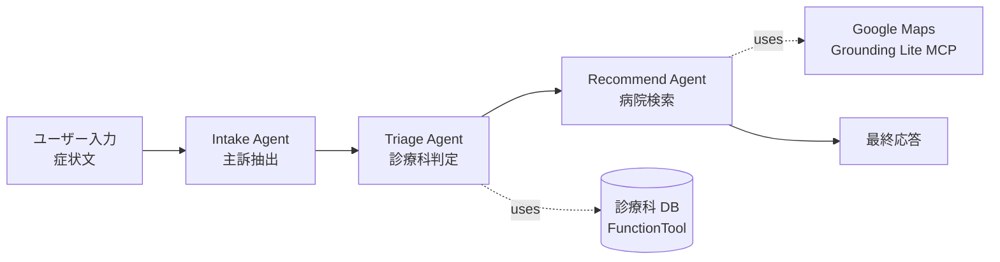

# ADK 2.0 ハンズオン: マルチエージェント医療トリアージ

このチュートリアルでは **Agent Development Kit (ADK) 2.0** を使い、患者の症状文から推奨診療科を判定し、近隣の医療機関を提示する **マルチエージェントシステム** を段階的に構築します。最終的に Vertex AI Agent Engine へデプロイし、Gemini Enterprise からの呼び出しまで一気通貫で体験します。

> **教育用デモの注意**
> 本チュートリアルは ADK の学習を目的とした教育用デモであり、実際の医療診断行為ではありません。題材として医療トリアージを採用していますが、実運用では医療規制や安全性検証が別途必要です。

## 全体像



| セクション | 時間 | 学習内容 |
|---|---|---|
| 事前準備 | 25 分 | Cloud Shell, ADK インストール, GCP API 有効化 |
| Step 01 シングルエージェント | 30 分 | `Agent` クラスの基本、instruction/description の役割 |
| Step 02 開発ツール | 20 分 | `adk web`, Events / Trace / State の見方 |
| ☕ 休憩 | 10 分 | |
| Step 03 Tools (関数) | 20 分 | 関数を `tools=[...]` に渡すだけでツール化 |
| Step 04 MCP (Maps) | 15 分 | `McpToolset` + Google 公式 Maps Grounding Lite |
| Step 05 マルチエージェント | 50 分 | `Workflow` で 3 エージェントをグラフ合成 |
| Step 05+ [オプション] | 10 分 | `google_search` で EvidenceAgent を追加 (早めに終わったグループ向け) |
| Step 06 Agent Engine デプロイ | 5 分 | `adk deploy agent_engine` (バックグラウンドビルド) |
| Step 07 Gemini Enterprise | 5 分 | デプロイ済み Agent Engine を GE から呼び出す (デモ) |
| Step 08 [ストレッチ] | 10-15 分 | `agents-cli` + Gemini CLI で AI にエージェントを改変させる (時間が許せば) |

合計: 180 分 (Step 08 を含めると 190-195 分)

## 前提条件

- 課金有効化済みの Google Cloud プロジェクト
- Cloud Shell が起動できるブラウザ環境
- ワークショップ当日に共有される **Google Maps Platform API キー** (Maps Grounding Lite 有効化済み)
- Python の基本知識 (関数定義、型ヒント、import)
- LLM / 生成 AI の基礎概念

---

## 事前準備: Cloud Shell + ADK 環境構築

### 0-1. Cloud Shell を起動してリポジトリをクローン

Cloud Shell を起動し、本リポジトリを取得します。

```bash
git clone https://github.com/yuting0624/adk-training.git
cd adk-training
```

### 0-2. setup.sh で一括セットアップ

セットアップは `setup.sh` 一発で完了します。以下を行います:

- GCP プロジェクト ID の検出
- 必要な API の有効化 (Vertex AI / Maps Grounding Lite / Cloud Run / Cloud Build / Artifact Registry)
- `uv` (Python パッケージマネージャ) のインストール
- `google-adk[mcp,gcp]==2.1.0` 系の依存関係インストール
- `.env` の生成 (プロジェクト ID と Vertex AI 設定を自動注入)
- Application Default Credentials の確認
- ADK の Python import + `adk` CLI のスモークテスト

```bash
./setup.sh
```

スクリプトが `[setup] Done.` で終了すれば成功です。所要時間は初回 3〜5 分。

### 0-2.5. (任意) verify.sh で事前ヘルスチェック

```bash
./verify.sh
```

API 有効化 / MAPS_API_KEY / Vertex AI モデル疎通 / ADC / app の import まで一通りプリフライト。Step 01 で詰まる前にここで弾けます (赤い FAIL がなければ OK)。

### 0-3. MAPS_API_KEY を設定

ワークショップ講師から配布された Maps API キーを `.env` に書き込みます。

```bash
# .env を開いて MAPS_API_KEY の値を書き換える
vim .env
# あるいは Cloud Shell エディタで:
cloudshell edit .env
```

`.env` の該当行:

```
MAPS_API_KEY=<workshop-shared-key>
```

> **API キー制限の確認 (講師アナウンス)**
> Step 04 で使う Maps Grounding Lite MCP (`mapstools.googleapis.com`) は、API キーの「API restrictions」で許可リストに入っていないと **403 Forbidden** で失敗します。配布されたキーは事前に許可済みのはずですが、自前のキーを使う場合は [Cloud Console > APIs & Services > Credentials](https://console.cloud.google.com/apis/credentials) でキーを開き、"Don't restrict key" にするか "Restrict key" の許可リストに **Maps Grounding Lite API** を追加してください。

### 0-4. ディレクトリ構成の確認

```
adk-training/
├── tutorial.md            ← 本ファイル
├── setup.sh               ← セットアップスクリプト
├── pyproject.toml         ← 依存関係定義
├── .env                   ← 環境変数 (gitignore 済、setup.sh が生成)
├── app/                   ← ワークショップ中に育てるエージェント
│   ├── __init__.py
│   └── agent.py           ← 最小スタブ (Step 01 で書き換える)
└── solutions/             ← 各 Step の完成形 (詰まったとき用)
    ├── 01_single_agent/
    ├── 02_tools/
    ├── 03_mcp/
    ├── 04_multi_agent/
    └── 05_safety_check/   ← Step 08 ストレッチの参考解
```

---

## Step 01. シングルエージェント (30 分)

### 学習目標

- ADK 2.0 の `Agent` クラスの主要パラメータを理解する
- `instruction` (自己への指示) と `description` (他者への自己紹介) の使い分けを身につける
- 用意された最小スタブを医療トリアージ用に書き換えて、`adk run` で動かす

### 解説: ADK 2.0 における Agent

ADK 2.0 では `from google.adk import Agent` でインポートできる `Agent` クラスが LLM 駆動エージェントの基本単位です (内部実装は `LlmAgent` のエイリアス)。

```python
from google.adk import Agent

root_agent = Agent(
    name="my_agent",
    model="gemini-3.5-flash",
    description="<このエージェントは何ができるかの 1〜2 文サマリ>",
    instruction="<このエージェント自身が実行時に従う詳細指示>",
    tools=[],  # 後の Step で追加
)
```

**`instruction` と `description` の役割分担** (中上級者向けの深掘りポイント):

- `instruction`: **このエージェント自身** が実行時に従う行動指示。役割、ルール、出力フォーマット、エッジケース対応を書く
- `description`: **他のエージェントや Workflow から見たときの自己紹介**。`AgentTool` や `Workflow` のノードとして使われた際、上位 LLM がこの description を読んで「呼び出すか / どのノードに進むか」を判断する

シングルエージェントの段階では description は使われませんが、後の Step 05 (Workflow) で重要になります。**早い段階から description を意識して書く習慣** をつけてください。

### ハンズオン

#### (a) 最小スタブを開いて構造を読む

[app/agent.py](app/agent.py) には最小の Agent が既に書かれています。これがエージェントの「種」です。

```bash
cloudshell edit app/agent.py
```

中身:

```python
from google.adk import Agent

root_agent = Agent(
    name="my_agent",
    model="gemini-3.5-flash",
    instruction="あなたは親切なアシスタントです。日本語で質問に答えてください。",
)
```

> **なぜ `adk create app` を使わないのか**
> `adk create` は対話プロンプトでモデル / バックエンド / プロジェクトを聞いて雛形 + `app/.env` を生成しますが、`app/.env` がリポジトリ root の `.env` と二重管理になってしまうため本ワークショップでは使いません。env は root の `.env` 一つに集約し、ADK は agent ディレクトリ単位で `load_dotenv()` 経由で読み込みます。

#### (b) 医療トリアージ用に書き換える

`app/agent.py` を以下に編集 (参考: [solutions/01_single_agent/agent.py](solutions/01_single_agent/agent.py)):

```python
from google.adk import Agent

root_agent = Agent(
    name="triage_agent",
    model="gemini-3.5-flash",
    description=(
        "患者の症状文から推奨される診療科候補を提示する医療トリアージ補助エージェント。"
    ),
    instruction="""\
あなたは医療トリアージを補助する AI アシスタントです。
ユーザーが症状を入力したら、以下のフォーマットで応答してください。

[出力フォーマット]
- 推奨診療科: 最も可能性の高い 1〜3 個の診療科を列挙
- 緊急度: 低 / 中 / 高
- 理由: 症状から各診療科を推奨する根拠を 1〜2 文で
- 注意事項: 「これは教育用の AI 応答であり、実際の診断ではありません。
  症状が続く場合は医療機関を受診してください。」を必ず付記。

[ルール]
- 断定診断は避け「候補」「可能性」という表現を使う
- 緊急度「高」と判断した場合は救急受診を促す
- 症状情報が不足する場合は追加質問を 1 つだけ返す
""",
)
```

#### (c) CLI で対話実行

```bash
uv run adk run app
```

以下のような症状を入力して試します:

- `最近、階段を上ると息切れがして胸も痛む`
- `子どもが昨日から 38.5 度の発熱があります`
- `朝起きたら顔の片側が動かしにくい` (← 緊急度「高」になるか確認)

### 振り返り / 深掘り

- LLM はあなたの `instruction` をどこまで忠実に守ったか? 「注意事項を必ず付記」のような明示的なルールは守られやすい一方、フォーマットは揺らぎがちです
- `Agent` には他にも `before_model_callback` / `after_model_callback` / `output_schema` (Pydantic で出力を構造化) などのフックポイントがあります。本ワークショップでは扱いませんが、本番では入出力検証やロギングに使えます

---

## Step 02. 開発ツール: adk web で可視化 (20 分)

### 学習目標

- `adk web` で起動する開発 UI の使い方を理解する
- Events / Trace / State タブで「何が起きているか」を確認する
- `adk eval` を実機実行し、LLM-as-judge による品質スコアの読み方を学ぶ

### 解説: adk web

`adk web <agents_dir>` は ADK 同梱の FastAPI + Web UI を起動します。`<agents_dir>` 配下の各サブディレクトリが個別エージェントとして UI のドロップダウンに並びます。

主要なタブ:

- **Chat**: LLM との対話画面
- **Events**: 各ターンで発生したイベント (model invocation, tool call, state update) の時系列
- **Trace**: OpenTelemetry 互換のトレースビュー。各処理の所要時間が一目で分かる
- **State**: Workflow / Session の共有 state の現在値 (Step 05 で重要)

### ハンズオン

#### (a) Web UI を起動

```bash
uv run adk web app --port 8000 --allow_origins "*"
```

Cloud Shell の右上 **「ウェブでプレビュー」** から **「ポート 8000 でプレビュー」** を選択。

#### (b) Chat で会話 → Events / Trace を確認

Chat で「動悸がする」と入力し、応答が返ったら **Events** タブを開きます。

確認ポイント:
- `model_call` イベントが 1 回発生している
- トークン使用量 (input / output) が表示される
- Trace ビューで model call が処理時間の大半を占めている

#### (c) adk eval で評価セットを実行する

ADK には `adk eval` というツールがあり、入出力期待値をセットで定義した「評価セット」に対して、エージェントの応答品質とツール呼び出し軌跡を自動評価できます。

リポジトリには Step 01 で作ったエージェント向けに用意した [app/evalset.json](app/evalset.json) があります (中身は 3 ケース: 胸痛 / 発熱 / 顔面麻痺)。実行してみましょう:

```bash
uv run adk eval app app/evalset.json --print_detailed_results
```

各ケースについて以下が表示されます:

- **`response_match_score`**: モデルの実応答と evalset の `final_response` を **LLM-as-judge で比較** したスコア (0〜1)
- **`tool_trajectory_avg_score`**: 期待されたツール呼び出し順序とのマッチ率 (Step 03 でツール装備後に意味を持つ)
- 各ケースが PASS / FAIL のどちらか (デフォルトしきい値)

> **Tips**: evalset を新規に作りたい場合は、Web UI (`adk web`) の Chat 画面で会話 → 右上の保存ボタンで「現在のセッションを eval ケースとして追加」できます。手書きより遥かに楽。

[app/evalset.json](app/evalset.json) を覗いて、`user_content` (入力) と `final_response` (期待出力) の構造を確認しておくと、Step 03 以降で「ツール呼び出し軌跡まで含めた評価」に拡張するイメージが湧きます。

### 振り返り / 深掘り

- LLM の応答時間は **input tokens に比例して増える**。本番では `instruction` を短くする、コンテキストを絞る工夫が効きます
- Events タブで「期待しないツール呼び出し」が見えたら、ツールの `description` か Agent の `instruction` の改善余地です

---

## Step 03. Tools: 関数をエージェントに装備 (20 分)

### 学習目標

- ADK 2.0 の「関数を直接 `tools=[...]` に渡す」パターンを使う
- ツールの docstring と型ヒントが LLM のツール選択判断にどう効くかを理解する
- ツール呼び出しを Trace で観察する

### 解説: ADK 2.0 の FunctionTool

ADK 2.0 では **Python 関数をそのまま `tools=[...]` に渡すだけ** でツールになります。`FunctionTool(...)` のような明示的ラッパーは不要です。

```python
def lookup_specialty(symptom_keyword: str) -> dict:
    """症状キーワードから対応する診療科候補と推奨緊急度を返す。

    Args:
        symptom_keyword: 患者の主訴を表すキーワード。

    Returns:
        candidates (list[str]), urgency (str), matched_keyword (str) を含む dict。
    """
    ...

Agent(..., tools=[lookup_specialty])
```

**LLM はどうやってツールを選ぶか** (中上級者向け):
- 関数名 → ツール名として LLM に渡る
- docstring → 「いつこのツールを使うべきか」の判断材料
- 型ヒント → 引数のスキーマ (JSON Schema 相当) を自動生成

**つまり docstring が雑だとツール選択も雑になる**。本番では docstring の品質が agent quality に直結します。

### ハンズオン

#### (a) app/agent.py を編集

`app/agent.py` を以下に書き換えます (参考: [solutions/02_tools/agent.py](solutions/02_tools/agent.py)):

```python
from google.adk import Agent

_SPECIALTY_DB: dict[str, dict] = {
    "胸痛": {"candidates": ["循環器内科", "呼吸器内科"], "urgency": "高"},
    "動悸": {"candidates": ["循環器内科", "心療内科"], "urgency": "中"},
    "息切れ": {"candidates": ["循環器内科", "呼吸器内科"], "urgency": "中"},
    "発熱": {"candidates": ["内科", "感染症内科"], "urgency": "中"},
    "頭痛": {"candidates": ["脳神経内科", "内科"], "urgency": "中"},
    "腹痛": {"candidates": ["消化器内科", "外科"], "urgency": "中"},
    "皮疹": {"candidates": ["皮膚科", "アレルギー科"], "urgency": "低"},
    "関節痛": {"candidates": ["整形外科", "リウマチ科"], "urgency": "低"},
}


def lookup_specialty(symptom_keyword: str) -> dict:
    """症状キーワードから対応する診療科候補と推奨緊急度を返す。

    Args:
        symptom_keyword: 患者の主訴を表すキーワード。
            例: "胸痛", "動悸", "発熱", "頭痛", "腹痛", "皮疹", "関節痛"。

    Returns:
        以下のキーを持つ dict:
            - candidates (list[str]): 推奨診療科のリスト
            - urgency (str): 緊急度 "低" / "中" / "高"
            - matched_keyword (str): 実際にマッチしたキーワード
    """
    for keyword, info in _SPECIALTY_DB.items():
        if keyword in symptom_keyword:
            return {**info, "matched_keyword": keyword}
    return {"candidates": ["総合診療科"], "urgency": "低", "matched_keyword": "default"}


root_agent = Agent(
    name="triage_agent",
    model="gemini-3.5-flash",
    description=(
        "患者の症状から、診療科データベースを参照して候補診療科と緊急度を提示する"
        "医療トリアージ補助エージェント。"
    ),
    instruction="""\
あなたは医療トリアージを補助する AI アシスタントです。
ユーザーが症状を入力したら、以下の手順で応答してください。

1. 症状文から主訴キーワードを抽出する
2. `lookup_specialty` ツールを必ず呼び出して、診療科候補と緊急度を取得する
3. 取得した結果を元に、以下のフォーマットで応答する

[出力フォーマット]
- 推奨診療科: <ツールが返した candidates を提示>
- 緊急度: <ツールが返した urgency を提示>
- 理由: <症状とツール結果を結びつける 1〜2 文>
- 注意事項: 「これは教育用の AI 応答であり、実際の診断ではありません。」
""",
    tools=[lookup_specialty],
)
```

#### (b) Web UI で実行 + Trace 観察

`adk web` を再起動 (Ctrl+C → 同じコマンド)、Chat で「胸が痛い」と入力。

**Events / Trace で確認**:
- `tool_call` イベントが発生し、`lookup_specialty` が呼ばれている
- 引数 `symptom_keyword="胸痛"` 程度のキーワードが渡る
- ツールの戻り値が次の model_call の context に入る

#### (c) ツールを呼ばないケースを観察

「ありがとう」とだけ入力するとどうなるか? LLM は instruction の「必ずツールを呼ぶ」を無視して雑談で返してしまう可能性があります。LLM の判断ベースのツール選択には、こうした取りこぼしリスクがあります。

### 振り返り / 深掘り

- ツール選択を LLM 任せにすると、**「呼ぶべきときに呼ばない」「呼ぶべきでないときに呼ぶ」** の両方の失敗が起こります
- 確実にツールを実行したい場合は、Step 05 の `Workflow` で「ノードとして必ず実行する」設計に切り替えるのが定石です

---

## Step 04. MCP: Google Maps Grounding Lite との接続 (15 分)

### 学習目標

- Model Context Protocol (MCP) の位置づけを理解する
- ADK 2.0 の `McpToolset` で外部 MCP サーバーに接続する
- Google 公式 Maps Grounding Lite MCP を使う

### 解説: MCP と Maps Grounding Lite

**MCP (Model Context Protocol)** は LLM とツール / データソースを繋ぐためのオープンプロトコルです。「ベンダー非依存の USB ポート」のような位置づけで、対応サーバーを書けば任意のクライアント (ADK / Claude Code / Cursor 等) から利用できます。

ADK 2.0 は MCP を `McpToolset` という形でサポートし、`tools=[...]` に渡すだけで関数ツールと同じインターフェースで扱えます。

**今回使用する MCP サーバー**: **Google 公式 Maps Grounding Lite MCP**
- URL: `https://mapstools.googleapis.com/mcp`
- 認証: `X-Goog-Api-Key` ヘッダ
- トランスポート: **Streamable HTTP**
- 提供機能: 場所検索 / 経路 / 天気 など、Maps Platform のグラウンディング機能

> **注**: かつて Anthropic がリファレンス実装として公開していた `@modelcontextprotocol/server-google-maps` (npm) は 2025 年に **deprecated / archived** となりました。本ワークショップではベンダー管理の Google 公式 MCP を使います。

### ハンズオン

#### (a) app/agent.py を MCP 対応に書き換え

`app/agent.py` を以下に置き換えます (参考: [solutions/03_mcp/agent.py](solutions/03_mcp/agent.py)):

```python
import os

from dotenv import load_dotenv
from google.adk import Agent
from google.adk.tools.mcp_tool import McpToolset, StreamableHTTPConnectionParams

load_dotenv()

_MAPS_API_KEY = os.environ.get("MAPS_API_KEY")
if not _MAPS_API_KEY or _MAPS_API_KEY.startswith("YOUR_"):
    raise RuntimeError("MAPS_API_KEY is not set. .env を確認してください。")

_maps_mcp = McpToolset(
    connection_params=StreamableHTTPConnectionParams(
        url="https://mapstools.googleapis.com/mcp",
        headers={"X-Goog-Api-Key": _MAPS_API_KEY},
        timeout=30.0,
        sse_read_timeout=300.0,
    ),
)

root_agent = Agent(
    name="hospital_recommender_agent",
    model="gemini-3.5-flash",
    description=(
        "指定された診療科とエリアから、Google Maps Grounding Lite MCP 経由で"
        "近隣の医療機関を検索・提示するエージェント。"
    ),
    instruction="""\
あなたは病院検索アシスタントです。
ユーザーから「診療科 + エリア (例: 東京駅周辺の循環器内科)」が示されたら、
Google Maps MCP のツールを使って近隣の医療機関を 3〜5 件検索し、以下の形式で提示してください。

[出力フォーマット]
1. <施設名>
   - 住所: <住所>
   - 距離・方角: <概算>
   - 備考: <評価や営業時間など分かれば>
2. ...

[ルール]
- 必ず Maps MCP のツールを呼び出す (記憶や推測で病院名を出さない)
- 結果が 0 件の場合は検索エリアを広げて再検索することを提案
""",
    tools=[_maps_mcp],
)
```

#### (b) Web UI で実行

`adk web` を再起動、Chat で以下を入力:

- `東京駅周辺の循環器内科を教えて`
- `渋谷駅から徒歩 10 分以内の小児科`

**Events / Trace で確認**:
- MCP サーバーへの HTTP 接続が確立されている
- ツール呼び出しがどんなパラメータで行われたか
- レスポンスの中身 (店舗名、住所、座標)

### 振り返り / 深掘り

- MCP には他に **stdio** (`StdioConnectionParams`) と **SSE** (`SseConnectionParams`) のトランスポートがあります。ローカルプロセスとして MCP サーバーを起動する場合は stdio が定番
- 2026 年現在、Google は **50+ の公式 MCP サーバー** を提供 (BigQuery / GKE / Workspace API 等)。

---

## Step 05. マルチエージェント: Workflow (50 分)

### 学習目標

- ADK 2.0 のマルチエージェント設計の選択肢 (Workflow / AgentTool / Task API) を理解する
- `Workflow` でグラフベースに 3 エージェントを合成する
- ノード間の入出力受け渡しを観察する

### 解説: ADK 2.0 マルチエージェント設計の 4 つの選択肢

ADK 2.0 で複数エージェントを束ねるパラダイムは大きく 4 つあります。

| パラダイム | 制御 | 適する場面 |
|---|---|---|
| **Workflow** (graph-based) | deterministic な順序・分岐 | 業務フローが固定 (本ワークショップ採用) |
| **AgentTool** | LLM が動的に sub-agent を呼ぶ | エージェントを「使うか」を LLM に任せたい |
| **sub_agents** (Agent transfer) | LLM が他のエージェントに「渡す」 | 専門領域別エージェントへの委譲 |
| **Task API** | 構造化された agent-to-agent タスク | multi-turn 委譲 / human-in-the-loop |

本ワークショップは **「問診 → トリアージ → レコメンド」 が固定順序** なので **Workflow** が最適です。

### 解説: Workflow API

```python
from google.adk import Agent, Workflow

root_agent = Workflow(
    name="my_workflow",
    edges=[
        ("START", node_a, node_b, node_c),  # START → a → b → c (sequence)
    ],
)
```

**edges の文法**:
- `("START", a, b, c)`: a → b → c の直列実行
- `("START", a, [b, c], d)`: a → (b と c を並列) → d (fan-out/fan-in)
- ノードは Agent でも普通の Python 関数でもよい
- 関数ノードは型ヒント付きパラメータで `ctx.state` から自動注入される

**state の共有**:
- `ctx.state["key"] = value` で全ノードから参照可能な dict 共有
- `yield Event(state={"key": value})` でも更新可能
- 本ハンズオンでは Agent 間のテキスト受け渡しのみ (シンプルさ優先)

### ハンズオン

#### (a) app/agent.py を Workflow に書き換え

`app/agent.py` を以下に置き換えます (参考: [solutions/04_multi_agent/agent.py](solutions/04_multi_agent/agent.py)):

```python
import os

from dotenv import load_dotenv
from google.adk import Agent, Workflow
from google.adk.tools.mcp_tool import McpToolset, StreamableHTTPConnectionParams

load_dotenv()

# --- 共有: Maps MCP ---
_MAPS_API_KEY = os.environ.get("MAPS_API_KEY")
if not _MAPS_API_KEY or _MAPS_API_KEY.startswith("YOUR_"):
    raise RuntimeError("MAPS_API_KEY is not set. .env を確認してください。")

_maps_mcp = McpToolset(
    connection_params=StreamableHTTPConnectionParams(
        url="https://mapstools.googleapis.com/mcp",
        headers={"X-Goog-Api-Key": _MAPS_API_KEY},
        timeout=30.0,
        sse_read_timeout=300.0,
    ),
)

# --- 共有: 診療科 DB FunctionTool ---
_SPECIALTY_DB: dict[str, dict] = {
    "胸痛": {"candidates": ["循環器内科", "呼吸器内科"], "urgency": "高"},
    "動悸": {"candidates": ["循環器内科", "心療内科"], "urgency": "中"},
    "息切れ": {"candidates": ["循環器内科", "呼吸器内科"], "urgency": "中"},
    "発熱": {"candidates": ["内科", "感染症内科"], "urgency": "中"},
    "頭痛": {"candidates": ["脳神経内科", "内科"], "urgency": "中"},
    "腹痛": {"candidates": ["消化器内科", "外科"], "urgency": "中"},
    "皮疹": {"candidates": ["皮膚科", "アレルギー科"], "urgency": "低"},
    "関節痛": {"candidates": ["整形外科", "リウマチ科"], "urgency": "低"},
}


def lookup_specialty(symptom_keyword: str) -> dict:
    """症状キーワードから推奨診療科候補と緊急度を返す。"""
    for kw, info in _SPECIALTY_DB.items():
        if kw in symptom_keyword:
            return {**info, "matched_keyword": kw}
    return {"candidates": ["総合診療科"], "urgency": "低", "matched_keyword": "default"}


# --- Node 1: 問診 ---
intake_agent = Agent(
    name="intake_agent",
    model="gemini-3.5-flash",
    description="患者の自由記述から主訴キーワードと希望エリアを抽出する。",
    instruction="""\
ユーザーが症状やエリアを述べたら、以下のフォーマット (1 行) で出力してください。
他の説明は一切付けません。

主訴: <最も顕著な症状を表す 1 単語>; エリア: <希望エリア または 「指定なし」>

例:
入力: 「最近よく胸が痛むんだ。東京駅周辺で病院を探したい」
出力: 主訴: 胸痛; エリア: 東京駅周辺
""",
)

# --- Node 2: トリアージ ---
triage_agent = Agent(
    name="triage_agent",
    model="gemini-3.5-flash",
    description="主訴キーワードから lookup_specialty ツールで診療科を推定する。",
    instruction="""\
入力にある「主訴: ...」の値を取り出し、必ず `lookup_specialty` ツールを呼んで結果を取得してください。
取得後、以下のフォーマット (1 行) で出力します。

診療科: <candidates の先頭>; 緊急度: <urgency>; エリア: <入力から引き継ぐ>
""",
    tools=[lookup_specialty],
)

# --- Node 3: 病院レコメンド ---
recommend_agent = Agent(
    name="recommend_agent",
    model="gemini-3.5-flash",
    description="診療科とエリアから Maps MCP で近隣医療機関を検索・提示する。",
    instruction="""\
入力にある診療科とエリアを使って、必ず Maps MCP のツールで近隣の医療機関を 3〜5 件検索し、
以下の形式で最終回答してください。

- 推奨診療科: <診療科>
- 緊急度: <緊急度> (高の場合は救急受診を強く促す)
- 近隣の候補医療機関:
  1. <施設名> (住所、距離)
  2. ...
- 注意事項:
  - これは教育用 AI 応答であり、実際の診断ではありません。
  - 症状が続く場合や緊急時は必ず医療機関を受診してください。
""",
    tools=[_maps_mcp],
)

# --- Workflow ---
root_agent = Workflow(
    name="medical_triage_workflow",
    edges=[("START", intake_agent, triage_agent, recommend_agent)],
)
```

#### (b) Web UI で end-to-end 実行

`adk web` を再起動、Chat で以下のような自然文を入力:

- `動悸がして、たまに胸も痛む。東京駅周辺で病院を探したい`
- `子どもが昨日から発熱している。渋谷区で小児科を教えて`
- `腹痛が続いている。新宿駅周辺で診てもらえる病院は?`

**Events タブで確認**:
- 3 つのエージェントが順番に呼ばれている
- 各エージェントの入出力テキストがバケツリレーで渡っている
- Node 2 で `lookup_specialty` が呼ばれる
- Node 3 で MCP ツールが呼ばれる
- 最終的にユーザーに返るのは Node 3 の出力

### 振り返り / 深掘り

- なぜ AgentTool ではなく Workflow なのか? AgentTool は LLM の判断でツール呼び出しが省略される可能性がある一方、Workflow はノードを **必ず** 実行する。トリアージのような **抜けが許されない業務フロー** に Workflow が適する
- 各 Agent の `description` を実際に書いた意味: Workflow 内では各ノードの description が他のノードや (将来) 並列 / 動的ルーティングの判断に使われる
- 改善余地: 現状は前ノードのテキスト出力をそのままパースしている。本番では Pydantic の `output_schema` で構造化出力にし、`ctx.state` 経由で受け渡すほうがロバスト

---

## Step 05+ [オプション]: EvidenceAgent を Workflow に追加 (10 分)

> このセクションは Step 05 が早めに終わったグループ向けのオプションです。スキップして Step 06 に進んでも OK。

### 学習目標

- ADK 2.x の組み込み `google_search` ツール (= Gemini ネイティブの Google 検索 grounding) をエージェントに装備する
- 「モデル内蔵ツール」と Function Tool / MCP の違いを体感する
- `Workflow` に 4 ノード目を追加するだけで拡張できる柔軟性を確認する

### 解説: ADK 2.x の `google_search`

```python
from google.adk.tools import google_search   # シングルトンインスタンス

Agent(..., tools=[google_search])
```

- **モデル内蔵ツール (built-in)** なので、Gemini が自動的に検索を実行して結果をコンテキストに混ぜる。ローカルでツール呼び出しの Python コードは走らない
- **Trace の見え方**: `tool_call` イベントとしては出ず、`model_call` の grounding metadata に現れる
- **他ツールと同居させたいとき**: 同じ Agent で Function Tool / MCP と併用したい場合は `GoogleSearchTool(bypass_multi_tools_limit=True)` を使う。本ケースは単独 Agent なので不要
- **モデル制限**: Gemini モデル専用 (`gemini-2.x` / `3.x`)。他社モデルでは `ValueError`

### ハンズオン

#### (a) EvidenceAgent を追加

`app/agent.py` の Workflow 末尾に以下のノードを追加 (参考: [solutions/06_evidence/agent.py](solutions/06_evidence/agent.py)):

```python
from google.adk.tools import google_search

evidence_agent = Agent(
    name="evidence_agent",
    model="gemini-3.5-flash",
    description=(
        "前ノードが提示した推奨診療科について Google 検索でエビデンスを補強し、"
        "代表的な症状・受診の目安を最終回答に追記する補強ノード。"
    ),
    instruction="""\
入力には「推奨診療科」と「近隣の候補医療機関リスト」が含まれています。

あなたのタスクは以下です:

1. Google 検索ツールで「<推奨診療科> 代表的な症状」「<推奨診療科> 受診の目安」を調べる
2. 入力テキストをそのまま冒頭に保持し、末尾に下記セクションを追記する

## 診療科について (参考情報)
- 代表的な症状: <検索結果から 2〜4 個を簡潔に>
- 受診の目安: <検索結果から 1〜2 文で>
- 出典: <検索結果のサイト名やドメインを 1〜2 個>

[ルール]
- 既存の応答 (病院リスト・推奨診療科・緊急度) は絶対に書き換えない (追記のみ)
- 検索結果が薄いときは「一般的な参考情報のみ」と明記し、断定しない
- 医療判断や処方アドバイスはしない
- 「これは教育用 AI 応答であり、実際の診断ではありません。」を末尾に必ず付記
""",
    tools=[google_search],
)

root_agent = Workflow(
    name="medical_triage_workflow_with_evidence",
    edges=[
        ("START", intake_agent, triage_agent, recommend_agent, evidence_agent),
    ],
)
```

#### (b) Web UI で 4 ノードの動作を確認

`adk web` を再起動し、`動悸がして、たまに胸も痛む。東京駅周辺で病院を探したい` と入力。

**Events / Trace で確認**:
- 4 つのエージェントが順番に呼ばれる (intake → triage → recommend → evidence)
- 4 ノード目の model_call に **grounding_metadata** が付与されている (Google 検索が走った証拠)
- 最終出力に「## 診療科について (参考情報)」セクションと出典が追加されている

### 振り返り / 深掘り

- **MCP vs 内蔵 google_search**: MCP はサーバーと HTTP/stdio で話すオープン規格。google_search は Gemini がトークン生成に grounding を組み込む native 機能。選択基準: 「外部 API ・他ツール群 = MCP」 / 「Google 検索だけ = google_search」
- **併用したい場合**: `from google.adk.tools.google_search_tool import GoogleSearchTool` + `GoogleSearchTool(bypass_multi_tools_limit=True)`。ただし「Function Tool / MCP と同居」は Trace が複雑化するため、本ワークショップでは **ノードを分ける設計** を推奨
- この拡張と Step 08 の SafetyCheckAgent は両方追加できる。その場合 Workflow は 5 ノード (Intake → Triage → Recommend → Evidence → SafetyCheck)

---

## Step 06. Agent Engine へデプロイ (5 分)

### 学習目標

- `adk deploy agent_engine` で Vertex AI Agent Engine にエージェントをデプロイする
- Agent Engine の reasoningEngine リソースモデルを理解する
- 環境変数 (MAPS_API_KEY) の渡し方を理解する

### 解説: Agent Engine とは

**Vertex AI Agent Engine** は ADK エージェント専用のマネージドランタイムです。Cloud Run と違って自分でコンテナや FastAPI を意識する必要がなく、エージェントを **reasoningEngine リソース** として登録するだけで、Vertex AI が runtime / scaling / monitoring を引き受けます。

Gemini Enterprise (Step 07) との連携は Agent Engine リソース ID を登録するだけで完結するため、エンタープライズ統合のデフォルトルートです。

| | Cloud Run | Agent Engine |
|---|---|---|
| ランタイム | コンテナ (FastAPI) | マネージド reasoningEngine |
| 単位 | Cloud Run Service | reasoningEngine リソース |
| GE 連携 | カスタムエージェントとして手動登録 | リソース ID をそのまま登録 (推奨) |
| 使い分け | 既存の Cloud Run 資産と統合したい | エージェント単体で運用したい |

### ハンズオン

#### (a) デプロイコマンド

```bash
uv run adk deploy agent_engine \
  --project=$GOOGLE_CLOUD_PROJECT \
  --region=us-central1 \
  --display_name="Medical Triage - $(whoami)" \
  --description="患者の症状から診療科を判定し近隣医療機関を提示する Workflow" \
  --trace_to_cloud \
  --env_file=.env \
  app
```

主なフラグ:
- `--region=us-central1`: Agent Engine のリージョン (Tokyo `asia-northeast1` も利用可)
- `--display_name`: GE などで表示される名前。**共有プロジェクトでは `$(whoami)` を入れて他の人と衝突しないように**
- `--trace_to_cloud`: Cloud Trace にトレース送信
- `--env_file=.env`: project root の `.env` を Agent Engine の環境変数として注入 (デフォルトは `<agent>/.env` を探すので明示)
- `app`: エージェントのソースコードフォルダ

> **依存関係**: Agent Engine は sandbox 内で `app/requirements.txt` を読んで依存をインストールします。本リポジトリではすでに `app/requirements.txt` を同梱済み (`google-adk[mcp]` + `python-dotenv`)。

> **⚠️ 共有 GCP プロジェクトを使う場合の注意**
> - 全員が `--display_name="Medical Triage Workflow"` で揃ってしまうと、Agent Engine コンソールで誰のリソースか分からなくなります。**必ず `$(whoami)` で個人識別子を入れる**
> - 他の参加者の reasoningEngine を **削除しないこと** (`gcloud ai reasoning-engines list` で見える他人のリソースは触らない)
> - 全員ほぼ同時にデプロイすると Cloud Build キューイングで待ち時間が長くなることがあります。**講師の合図でずらして投入** すると安心

初回ビルドは 5〜8 分かかります。**コマンド投入後、ビルド待機中に Step 07 のデモを並行で見てください。**

#### (b) デプロイ結果の確認

デプロイ完了後、reasoningEngine のフルリソース名が表示されます (例: `projects/yuting-claw-sandbox/locations/us-central1/reasoningEngines/1234567890123456789`)。**この ID を Step 07 で使います。**

```bash
# Agent Engine リソース一覧で確認
gcloud ai reasoning-engines list --region=us-central1 --project=$GOOGLE_CLOUD_PROJECT
```

### 振り返り / 深掘り

- `--env_file` で指定した `.env` は Agent Engine の runtime 環境変数になります。本番では Secret Manager + Workload Identity 経由が推奨
- 既存の Agent Engine リソースを更新したい場合は `--agent_engine_id=<id>` を追加 (省略時は新規作成)
- `adk deploy cloud_run` (Cloud Run)、`adk deploy gke` (GKE) も同じ CLI からデプロイ可能。GE 連携前提なら Agent Engine が最短ルート

---

## Step 07. Gemini Enterprise からの呼び出し (5 分・ライブデモ)

### 学習目標

- Agent Engine リソースを Gemini Enterprise から呼び出す全体像を理解する
- AI Agent をエンタープライズアプリに組み込む際の構成要素を把握する

### デモ内容 (講師が実演)

Step 06 で出力された **reasoningEngine リソース名** (`projects/.../reasoningEngines/...`) を使います。

1. Google Cloud コンソールから **Gemini Enterprise → Agent Builder** を開く
2. **「Add agent」 → 「From Agent Engine」** を選択し、reasoningEngine リソース ID を貼り付けて登録
3. Gemini Enterprise の Chat UI から「動悸がする。東京駅周辺で病院を」と入力
4. Agent Engine 上の Workflow が呼び出され、最終応答が GE 上に表示される
5. 監査ログ / トレース / レート制限などのエンタープライズ機能を紹介

Cloud Run カスタム agent と違って **エンドポイント URL / 認証フローを書かなくて済む** のが Agent Engine 経由の利点です。

> **補足: `agents-cli publish gemini-enterprise`**
> このコンソール操作はコマンドラインからも実行できます (後述の `agents-cli` 参照)。CI/CD パイプラインに組み込む場合はコマンド版が便利です。

---

## Step 08 [ストレッチ]: agents-cli で AI にエージェントを改変させる (10-15 分)

> このセクションは時間に余裕がある場合のオプションです。Step 07 までで主要内容は完了しています。

### 学習目標

- `agents-cli` の位置づけ (ADK の代替ではなく **コーディングエージェント向け Skills プロバイダ**) を体感する
- 普段使うコーディング AI に ADK 専門知識を授け、自然言語で Workflow を拡張できることを体験する
- 「素のADKを理解してからAI生成コードをレビューする」スキルを身につける

### 解説: agents-cli とは

[`agents-cli`](https://github.com/google/agents-cli) は Claude Code / Gemini CLI / Codex / Antigravity などのコーディングエージェントに **ADK 開発の専門 Skills (`adk-code` / `scaffold` / `eval` / `deploy` / `publish` / `observability`)** を授ける CLI + Skills バンドルです。

`adk` CLI を置き換えるものではなく、**ADK 開発のライフサイクル全体を コーディング AI 越しに自動化** するためのレイヤーです。今日まで手で書いてきたパターンを、AI に「同じ流儀で」量産させられます。

### 改変チャレンジ: SafetyCheckAgent を追加せよ

現在の Workflow は `Intake → Triage → Recommend` の 3 ノード。最終応答に医療免責事項が常に含まれている保証は instruction 任せです。

**課題**: Workflow の末尾に `SafetyCheckAgent` を追加し、最終応答に以下 3 点が含まれているかチェック・不足を補完するノードを追加してください:

1. 「教育用 AI 応答」または同等の免責表現
2. 「実際の診断ではない」旨
3. 「医療機関を受診」を促す文言

**成功条件**: `adk web app` で実行し、Events タブで 4 ノード目が呼ばれること、最終応答に必ず 3 点が含まれること。

### ハンズオン

#### (a) agents-cli をインストール

```bash
uvx google-agents-cli setup
```

このコマンドだけで `agents-cli` CLI 本体と、Cloud Shell に既にインストールされている Gemini CLI への ADK 専門 Skills が一括で組み込まれます。

#### (b) Gemini CLI を起動

```bash
gemini
```

#### (c) AI に改変を依頼

Gemini CLI のプロンプトに以下を入力 (コピペでOK):

```
@app/agent.py に SafetyCheckAgent を追加してください。

要件:
- Workflow の末尾 (recommend_agent の後) に追加する
- 入力テキストを確認し、以下 3 つの医療免責事項がすべて含まれているかチェック
  1. 「教育用 AI 応答」または同等の免責表現
  2. 「実際の診断ではない」旨
  3. 「医療機関を受診」を促す文言
- 不足があれば入力末尾に補って完全な応答を返す
- すべて揃っていれば入力をそのまま返す
- 医療判断・推奨自体は絶対に変更しないこと
- model は gemini-3.5-flash
```

agents-cli が組み込んだ Skills のおかげで、Gemini CLI は ADK 2.0 の Workflow / Agent API を正しく使ったコードを生成します。

#### (d) 生成コードをレビュー

AI が `app/agent.py` を書き換えたら、必ず以下を確認してから保存:

- `safety_check_agent = Agent(...)` の定義が追加されている
- `Workflow` の `edges` 末尾に追加されている (`("START", intake_agent, triage_agent, recommend_agent, safety_check_agent)`)
- `instruction` が「判断は変更せず注記のみ補完」になっている
- 既存のロジックが壊れていない

**ここが今日のワークショップの真の目的**: AI生成コードのレビュー眼。素のADKを Step 01-05 で書いてきたから、ここで「これは正しいADK 2.0コードか?」を判断できます。

> 詰まったとき / AI出力と比較したいときは [solutions/05_safety_check/agent.py](solutions/05_safety_check/agent.py) を参照。

#### (e) adk web で動作確認

```bash
uv run adk web app --port 8000 --allow_origins "*"
```

- Events タブで `safety_check_agent` が 4 ノード目として呼ばれていること
- 最終応答に 3 点の注意事項がすべて含まれていること
- 試しに `recommend_agent` の instruction から注意事項の記述を削除して、それでも最終応答に補完されるか確認

### 振り返り / 深掘り

- **コーディング AI + agents-cli の生産性向上**: 同じ要件を素で書いたら何分かかったでしょう? AI 経由なら 2-3 分で初版が出ます
- **Skills の中身**: `~/.gemini/extensions/` 配下や agents-cli のリポジトリに、ADK の API ガイドや prompt が入っています。プロジェクト固有の Skills を書いて、AI にチーム特有の規約を教えることも可能
- **agents-cli の他コマンド**: `agents-cli eval` (評価実行)、`agents-cli deploy` (デプロイ)、`agents-cli publish gemini-enterprise` (GE登録) など、本ワークショップでやった作業がすべてコマンド化されています。CI/CD パイプラインに組み込みやすい

> **時間がない場合のフォールバック**: 講師が `agents-cli` で同じ改変を 3 分実演し、生成コードを参加者と一緒にレビュー、で十分価値が伝わります。

---

## まとめ

このワークショップで体験したこと:

- ADK 2.0 の `Agent` クラスでシングルエージェントを構築
- 関数を `tools=[...]` に渡すだけのシンプルなツール統合
- `McpToolset` で外部 MCP サーバー (Google Maps Grounding Lite) を接続
- `Workflow` でグラフベースに 3 エージェントを直列合成
- `adk deploy agent_engine` で Vertex AI Agent Engine にデプロイ
- Gemini Enterprise からの呼び出しでエンタープライズ統合の全体像

### 次に学ぶべきこと

- **`Workflow` の高度なパターン**: fan-out/fan-in, loop, dynamic routing, retry
- **Task API**: agent-to-agent の構造化委譲、human-in-the-loop
- **`output_schema` + Pydantic**: ロバストな構造化出力
- **adk eval**: LLM-as-judge による回帰テスト
- **Agent Engine**: Vertex AI のマネージドエージェントランタイム
- **A2A プロトコル** (`google-adk[a2a]`): 分散エージェント間通信

### コーディングエージェントと組み合わせる: `agents-cli`

Step 08 で導入した [`agents-cli`](https://github.com/google/agents-cli) は、本ワークショップで手作業した開発フローのほぼ全てを Claude Code / Gemini CLI / Codex 経由で自動化できる Skills + CLI バンドルです。

他にも以下の Skills が提供されており、業務での ADK エージェント量産に活用できます:

| Skill | カバー範囲 |
|---|---|
| `google-agents-cli-eval` | 評価メソドロジー (LLM-as-judge / trajectory) |
| `google-agents-cli-deploy` | Agent Runtime / Cloud Run / GKE / CI/CD |
| `google-agents-cli-publish` | Gemini Enterprise への登録 (`agents-cli publish gemini-enterprise`) |
| `google-agents-cli-observability` | Cloud Trace / Logging 連携 |

ワークショップ後に自分の業務でも試してみてください。「素のADKを今日理解した」という土台があれば、AI 生成コードのレビューや微修正もスムーズです。

### リファレンス

- ADK Python (GitHub): https://github.com/google/adk-python
- ADK ドキュメント: https://adk.dev/
- Workflow サンプル: https://github.com/google/adk-python/tree/main/contributing/samples/workflows
- MCP サンプル: https://github.com/google/adk-python/tree/main/contributing/samples/mcp
- Maps Grounding Lite: https://developers.google.com/maps/ai/grounding-lite
- Google 管理 MCP 一覧: https://cloud.google.com/blog/products/ai-machine-learning/google-managed-mcp-servers-are-available-for-everyone
- agents-cli (コーディングエージェント向け Skills): https://github.com/google/agents-cli

お疲れさまでした。
